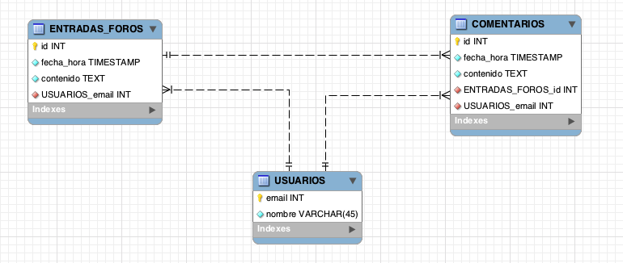

###Escuela Colombiana de Ingeniería
###Procesos de Desarrollo de Software - PDSW
##Laboratorio - Patrón DAO, JDBC, y pruebas.

###Parte 1. JDBC (Para el martes, antes de clase).

En un motor de base de datos MySQL Se tiene un esquema con el siguiente modelo de base de datos (un registro de pedidos de productos):


1. Clone el proyecto disponible en https://github.com/PDSW-ECI/JDBC_Intro.git .
3. Ajuste los parámetros de conexión del programa:

	```java
String url="jdbc:mysql://desarrollo.is.escuelaing.edu.co:3306/bdprueba";
String driver="com.mysql.jdbc.Driver";
String user="bdprueba";
String pwd="bdprueba";
```


2. Revise la documentación de ‘PreparedStatement’, del API JDBC:
[http://docs.oracle.com/javase/tutorial/jdbc/basics/prepared.html](http://docs.oracle.com/javase/tutorial/jdbc/basics/prepared.html). Teniendo en cuenta esto, implemente las operaciones faltantes (la operación que hace el cálculo del valor de un pedido debe hacerlo mediante SQL). Para las operaciones c y d use su código de estudiante, de manera que no haya conflicto con sus compañeros (todos están usando la misma base de datos).

	* nombresProductosPedido
	* valorTotalPedido
	* cambiarNombreProducto
	* registrarNuevoProducto

5. Ejecute las operaciones y rectifique los resultados. Operaciones a y b por pantalla, operaciones c y d consultando en la base de datos con un cliente MySQL.

###Parte 2. Patrón DAO (Martes en clase).

####Nota: este ejercicio se debe realizar colaborativamente haciendo uso de un repositorio git centralizado tal como github o gitlab.

Para este ejercicio, va a implementar la capa de persistencia para el ejercicio anterior, en el cual se desarrolló una aplicación Web para manejar un sistema de foros en línea. El siguiente, es el modelo de base de datos en el que se va a hacer persistente la información registrada a través de la aplicación:



El siguiente, es el diagrama de clases de la implementación del patrón DAO para este problema, en donde -por ahora- sólo se maneja el DAOUsuario:


1. Implemente una prueba para cada una de las siguientes clases de equivalencia:

	| #CE	| Método        | Clase de equivalencia           | Tipo  |
| ---	| ------------- |:-------------| -----:|
| 1| DAOUsuario.save()      | Usuario nuevo | Correcta/Estándar |
|2	| DAOUsuario.save()      | Usuario que fue previamente registrado      |   Incorrecta/Estándar |

2. A partir de lo revisado en el punto 1, implemente SÓLO las operaciones save() y load() de JDBCDaoUsuario. Use sus pruebas para validar la correcta implementación.


###Parte 3. Para el Jueves.

1. A su modelo, teniendo en cuenta el ejercicio hecho anteriormente en clase, agregue el DAOEntradaForo (todas las clases/interfaces que éste implique).
2. Defina las clases de equivalencia para probar el método 'save' de dicho DAO. Para esto, tenga en cuenta que debe permitir guardar nuevas entradas de foro que vengan con o sin respuestas.
3. Implemente las operaciones 'save' y 'load', y use las pruebas para validar su correcta implementación. Para el 'load' tenga en cuenta [EVITAR LAS CONSULTAS DE TIPO N+1](https://laracasts.com/discuss/channels/general-discussion/what-is-the-meaning-of-the-n-1-problem).


